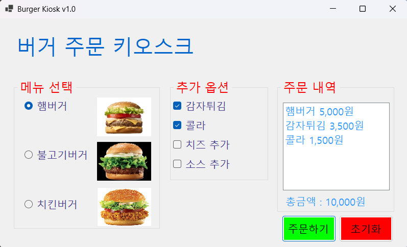
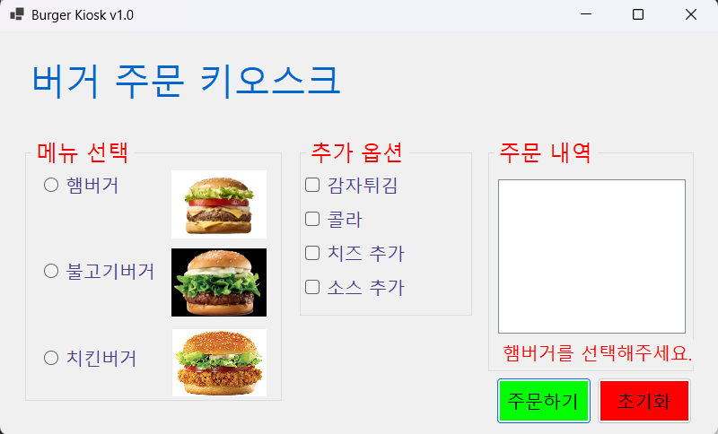
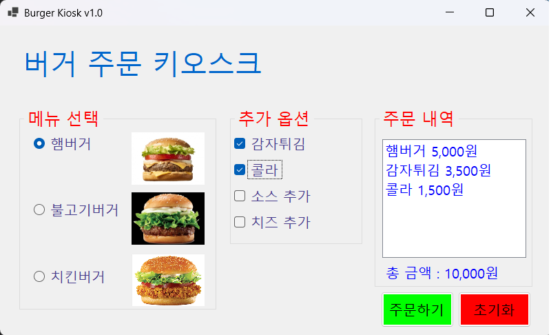

# (C# 코딩) 버거 키오스크
## 개요- C# 프로그래밍 학습
- 1줄 소개 : 선택한 메뉴와 추가옵션을 계산하고 표시하여 주문을 돕는 프로그램
- 사용한 플랫폼 :
    - C#, .NET Windows Forms, Visual Studio, GitHub
- 사용한 컨트롤 :
    - Label, Button, ListBox, RadioButton, CheckBox, GroupBox
- 사용한 기술과 구현한 기능 :
    - Visual Studio를 이용하여 UI 디자인
    - 첫번째 GroupBox (메뉴 선택) 에서 메뉴를 선택 (1개만 선택 가능)
    - 두번째 GroupBox (추가 옵션) 에서 추가 옵션을 선택 (여러개 선택 가능)
    - 세번째 GroupBox (주문 내역) 에서 주문한 메뉴들과 가격을 표시
## 실행 화면
- 1단계 코드의 실행 스크린샷

- 구현한 내용 (위 그림 참조)
    - UI 구성 : Label(앱 이름 표시, 총 금액 표시), GroupBox 3개(메뉴 선택, 추가 옵션, 주문 내역), RadioButton 3개(메뉴 햄버거, 불고기버거, 치킨버거), CheckBox 4개(추가 옵션 감자튀김, 콜라, 치즈 추가, 소스 추가), ListBox 1개(주문 내역 표시)
    - 주문하기 버튼 : 클릭 시 앞서 선택했던 메뉴와 추가 옵션들의 정보와 가격이 ListBox에 표시되고 총 금액이 계산되어 표시
    - 초기화 버튼 : 클릭 시 모든 선택이 해제되고 ListBox와 총 금액도 전부 처음 상태로 초기화

- 2단계 코드의 실행 스크린샷

- 구현한 내용 (위 그림 참조)
    - 선택 해제 : 첫 시작 시 자동으로 선택되는 RadioButton의 선택 해제
    - 오류 메시지 : 메뉴 선택을 하지 않고 주문하기 버튼을 클릭 시 총 금액을 표시하는 Label을 바꿔 메뉴 선택을 부탁

- 3단계 코드의 실행 스크린샷

- 구현한 내용 (위 그림 참조)
    - 키보드 입력 : Tab키를 눌러 GroupBox 사이를 이동, 방향키를 눌러 현재의 GroupBox 내에서 메뉴들을 선택, 스페이스바를 눌러 CheckBox의 요소들을 체크, Enter키를 눌러 주문, esc키를 눌러 초기화를 수행

- 4단계 코드의 실행 스크린샷
(여기에 이미지 삽입)

## 배운 내용
- 키보드 입력을 받아 앱을 사용하도록 만들 때(3단계) 메뉴 선택 GroupBox로 이동하지 않는 등의 문제들이 발생하였으나, copilot의 도움을 받아 해결하였습니다.